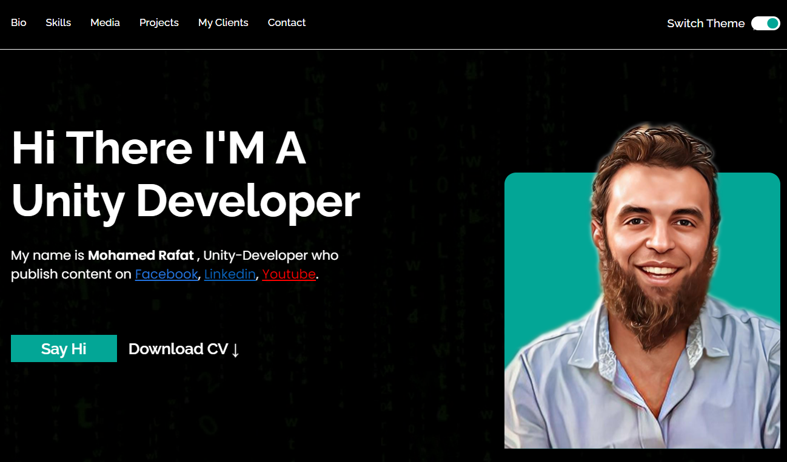

# Frontend Mentor Challenge: Project Title

Welcome to my solution for the Course Advanced CSS: Responsive Design, Animations, SASS challenge! This project is a frontend development exercise that involves creating a responsive webpage based on a given design. The goal is to practice and enhance HTML, CSS, Flexbox, CSS Grid, and SASS skills.

## Table of Contents

- [Overview](#overview)
  - [Challenge](#challenge)
  - [Screenshot](#screenshot)
  - [Links](#links)
- [My Process](#my-process)
  - [Built With](#built-with)
  - [What I Learned](#what-i-learned)
  - [Continued Development](#continued-development)
  - [Useful Resources](#useful-resources)
- [Acknowledgments](#acknowledgments)

## Overview

### Challenge

The challenge is to build out the project to the provided design mockup, ensuring that it is fully responsive and looks good on all screen sizes. The key objectives include:

- Creating a responsive layout using modern CSS techniques.
- Implementing design specifications accurately.
- Writing clean, maintainable, and scalable code.

### Screenshot

### Links

- Solution URL: [GitHub Repository](https://github.com/MohamedRafatabotaleb/personal-website#solution-url)
- Live Site URL: [Personal Website](https://mohamedrafatabotaleb.github.io/personal_website/)

## My Process

### Built With

- Semantic HTML5 markup
- CSS custom properties
- Flexbox
- CSS Grid
- SASS (SCSS syntax)

### What I Learned

Throughout this project, I gained valuable experience in:

- **HTML:** Improved the structure and semantic quality of HTML.
- **CSS:** Leveraged CSS custom properties for easier theme management and reuse.
- **Flexbox:** Utilized Flexbox for aligning and distributing space among items in a container.
- **CSS Grid:** Applied CSS Grid for complex layouts and ensured responsiveness.
- **SASS:** Enhanced my workflow with SASS by using variables, nesting, and mixins for better code organization and maintainability.

### Continued Development

I plan to continue improving my skills in the following areas:

- **Accessibility:** Ensuring that the project is accessible to all users.
- **Advanced CSS Techniques:** Exploring more advanced CSS features and animations.
- **JavaScript Integration:** Adding interactivity with JavaScript in future projects.

### Useful Resources

- [CSS Tricks: A Complete Guide to Flexbox](https://css-tricks.com/snippets/css/a-guide-to-flexbox/) - This guide helped me understand Flexbox and its properties.
- [CSS Tricks: A Complete Guide to Grid](https://css-tricks.com/snippets/css/complete-guide-grid/) - This resource was invaluable for learning CSS Grid.
- [SASS Documentation](https://sass-lang.com/documentation) - Official documentation for SASS, which provided guidance on using SASS features effectively.

## Acknowledgments

I would like to thank Frontend Mentor for providing this challenge and the community for their support and feedback.

Feel free to reach out if you have any questions or feedback!

## Author
[Mohamed Rafat](https://github.com/MohamedRafatabotaleb)
